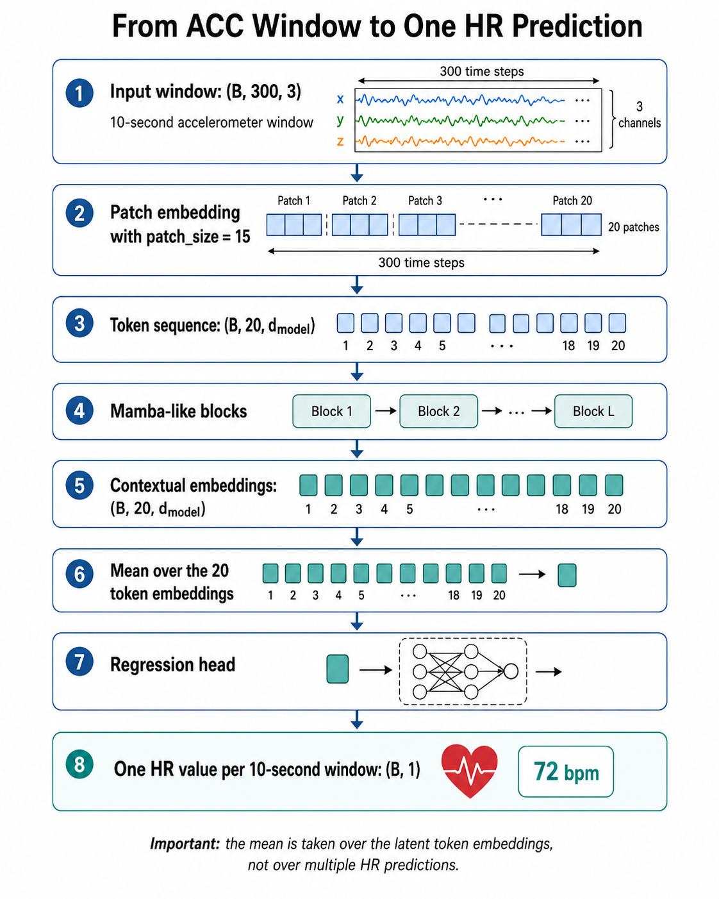

# HR Regression with a Mamba-like Backbone

This document describes a simple heart-rate regression pipeline using accelerometer windows and a Mamba-inspired temporal backbone.

## Pipeline overview



The model receives one 10-second accelerometer window and predicts one scalar heart-rate value for that full window.

```text
Input window: (B, 300, 3)
        ↓
Patch embedding with patch_size = 15
        ↓
Token sequence: (B, 20, d_model)
        ↓
Mamba-like blocks
        ↓
Contextual embeddings: (B, 20, d_model)
        ↓
Mean over the 20 token embeddings
        ↓
Regression head
        ↓
One HR value per 10-second window: (B, 1)
```

## Input and target

The expected input is accelerometer data sampled at 30 Hz:

```text
10 seconds × 30 Hz = 300 time steps
```

So each sample has shape:

```python
x.shape = (300, 3)
```

where the 3 channels are usually:

```text
acc_x, acc_y, acc_z
```

During training, the batch has shape:

```python
x_batch.shape = (B, 300, 3)
```

The target is one heart-rate value for the same 10-second window:

```python
y_batch.shape = (B, 1)
```

A reasonable first target is the mean HR inside the 10-second window.

## Why one HR value per window?

This setup is a **many-to-one regression problem**:

```text
300 accelerometer samples → 1 HR value
```

The Mamba-like backbone does **not** directly predict HR at every timestamp. Instead, it produces contextual latent embeddings for each patch. Then the model averages those latent embeddings and passes the summarized vector to a regression head.

So this operation:

```python
x = x.mean(dim=1)
```

means:

```text
average the 20 latent token embeddings
```

It does **not** mean averaging 20 HR predictions.

## Shape flow

| Stage | Tensor shape | Meaning |
|---|---:|---|
| Raw input | `(B, 300, 3)` | 10-second ACC window |
| Patch embedding | `(B, 20, d_model)` | 20 patches, each covering 15 samples |
| Mamba-like blocks | `(B, 20, d_model)` | contextual token embeddings |
| Mean pooling | `(B, d_model)` | one representation for the full window |
| Regression head | `(B, 1)` | predicted HR in bpm |

## Recommended first configuration

```python
model = HRMambaLikeRegressor(
    input_channels=3,
    seq_len=300,
    patch_size=15,
    stride=15,
    d_model=128,
    depth=4,
    d_state=16,
    expand=2,
    dropout=0.1,
)
```

This configuration gives:

```text
300 / 15 = 20 tokens
```

That keeps the sequence short enough for a pure PyTorch selective-scan implementation.

## Training objective

Use a regression loss, not classification loss.

Recommended starting loss:

```python
criterion = torch.nn.SmoothL1Loss(beta=5.0)
```

Alternative:

```python
criterion = torch.nn.MSELoss()
```

For reporting, use:

```text
MAE  = mean absolute error in bpm
RMSE = root mean squared error in bpm
```

## Minimal training step

```python
model.train()

for x, hr in train_loader:
    x = x.to(device).float()              # (B, 300, 3)
    hr = hr.to(device).float().view(-1, 1) # (B, 1)

    pred_hr = model(x)                    # (B, 1)
    loss = criterion(pred_hr, hr)

    optimizer.zero_grad()
    loss.backward()
    optimizer.step()
```

## Evaluation metrics

```python
with torch.no_grad():
    pred_hr = model(x)

mae = torch.mean(torch.abs(pred_hr - hr))
rmse = torch.sqrt(torch.mean((pred_hr - hr) ** 2))
```

Interpretation:

```text
MAE = average absolute error in bpm
RMSE = error metric that penalizes large mistakes more strongly
```

## Suggested experiment order

1. Train ACC-only HR regression:

```text
Input:  (B, 300, 3)
Target: mean HR in the 10-second window
Output: (B, 1)
```

2. Compare with simpler baselines:

```text
CNN regressor
LSTM/GRU regressor
Transformer encoder regressor
Mamba-like regressor
```

3. Only after the HR-regression baseline works, add self-supervised or multitask variants:

```text
ACC → HR regression
masked ACC → ACC reconstruction
ACC → HR regression + masked ACC reconstruction
```
